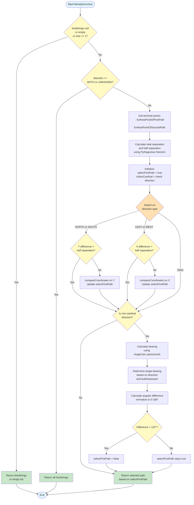

# DirectionFilterHelper Data Flow



## Flow Description

The diagram illustrates the data flow through the `DirectionFilterHelper.filterPathsByDirection()` method:

1. **Entry point**: `filterPathsByDirection` method receives lineStrings, buildUpstream flag, and direction
2. **Early exits**: Returns immediately for null/empty lists or BOTH/UNKNOWN directions
3. **Cardinal direction handling**: Uses coordinate comparison for N/S/E/W with separation checks
4. **Non-cardinal direction handling**: Uses bearing calculations for NE/SE/SW/NW
5. **Decision logic**: The `selectFirstPath` boolean determines which path is returned
6. **Helper methods**: `getTerminalPoint` and `compareCoordinates` are invoked within the flow

## Pythagorean Theorem in Distance Calculation

The algorithm uses the Pythagorean theorem to calculate the total separation between the terminal points of two paths:

```
                    Point 2 (x₂, y₂)
                         ●
                        /|
                       / |
                      /  |
        totalSep     /   | yDiff = |y₂ - y₁|
                    /    |
                   /     |
                  /      |
                 /       |
                /        |
               ●---------+
        Point 1 (x₁, y₁)
               
               xDiff = |x₂ - x₁|


    totalSeparation = √(xDiff² + yDiff²)
    halfSeparation = totalSeparation / 2
```

**Key Concepts:**
- **Point 1**: Terminal point of first LineString (`furthestPointOfFirstPath`)
- **Point 2**: Terminal point of last LineString (`furthestPointOfSecondPath`)
- **xDiff**: Horizontal distance between points = `|x₂ - x₁|`
- **yDiff**: Vertical distance between points = `|y₂ - y₁|`
- **totalSeparation**: Euclidean distance using `√((x₂ - x₁)² + (y₂ - y₁)²)`
- **halfSeparation**: Used as threshold to determine if paths are divergent enough for directional filtering

**Example Use Case:**
For NORTH/SOUTH filtering, if `yDiff < halfSeparation`, the paths are too horizontal (not divergent enough in the Y direction) to make a reliable directional determination, so the algorithm defaults to returning the first path.
